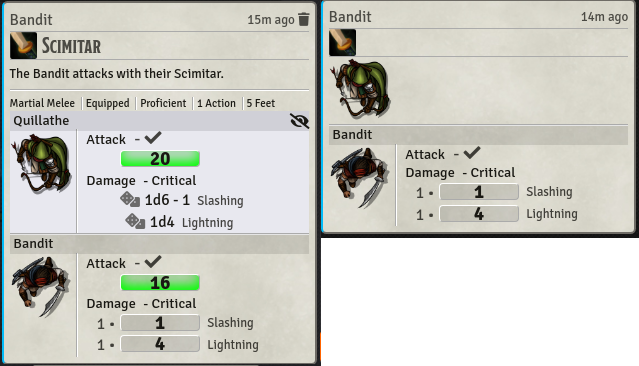
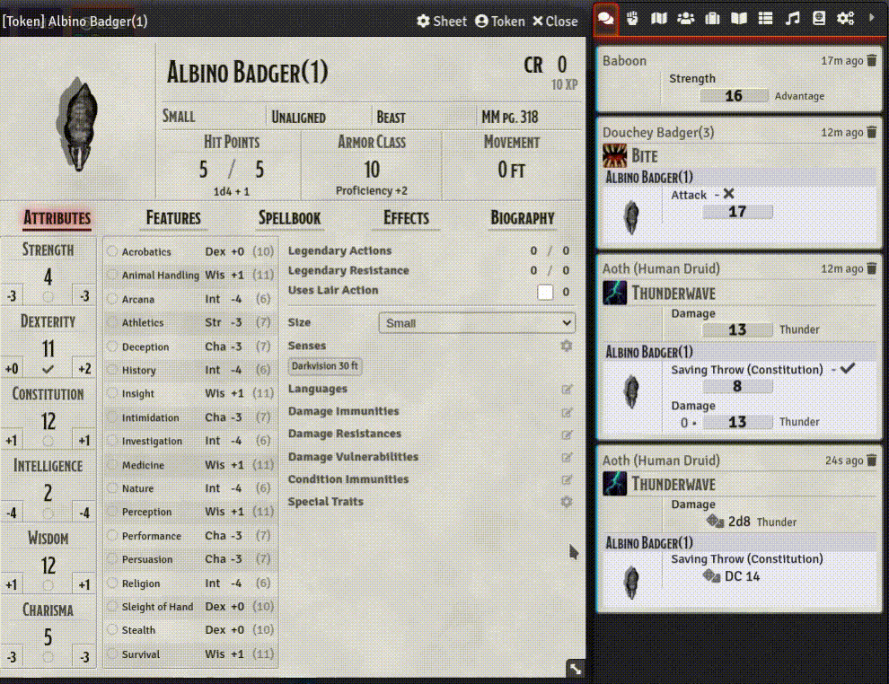
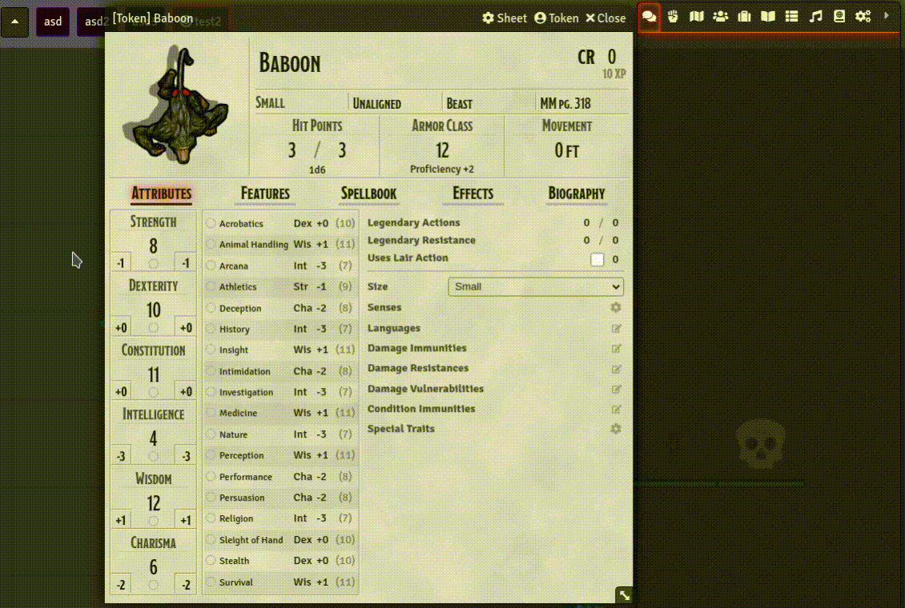
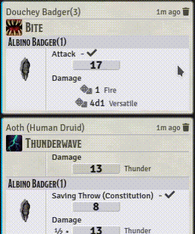
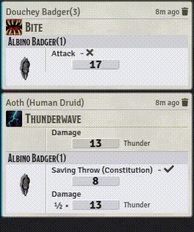
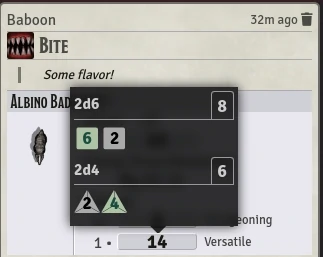
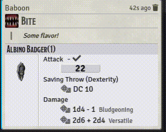

# MARS 5e - Moerills alternative rolling style for 5e

   

This module provides an opinionated alternative to how the roll workflow in DnD5e and how they're displayed.  
Main goal is to provide some flexibility in how much information is displayed to the players from the GM side, while also automating some basic tasks. To avoid having to care about all possible edge cases and houserules almost every automatic generated result is toggleable.

**This is a replacement for the part of MESS that modified DnD 5es rolling! While it is not exactly the same, this is my new revision of it and MESS won't be maintained in this regard anymore!**

## Bug Reporting and Feature Suggestions
Go to the [GitHub's issue board](https://github.com/Moerill/fvtt-mars-5e/issues) and create an issue with the template fitting to what you want to post and follow its instructions.

**I will ignore half-hearted bug reports ignoring the issue template or Discord mentions!**  
Its not difficult to put at least some effort into something that you want someone else to put their spare time into to fix!  

## Support the development
I'm doing this project mostly alone (with partial help of some wonderful people mentioned above) in my spare time and for free.  
If you want to encourage me to keep doing this, i am happy about all kind of tokens of appreciation. (Like some nice words, recommending this project or contributions to the project).  
What about donations? I do feel very honored that you think about giving me a donation! Instead I'd prefer if you send the cash to a good cause of your choosing!

- [MARS 5e - Moerills alternative rolling style for 5e](#mars-5e---moerills-alternative-rolling-style-for-5e)
	- [Bug Reporting and Feature Suggestions](#bug-reporting-and-feature-suggestions)
	- [Support the development](#support-the-development)
	- [Targets](#targets)
		- [Item/Spell targets](#itemspell-targets)
		- [Token pictures](#token-pictures)
	- [GM sees it all, players do not](#gm-sees-it-all-players-do-not)
	- [Basic automation](#basic-automation)
		- [Attack rolls vs AC](#attack-rolls-vs-ac)
		- [Saving throw vs DC](#saving-throw-vs-dc)
		- [Resistance check](#resistance-check)
	- [Use Right-Click to toggle stuff](#use-right-click-to-toggle-stuff)
		- [(Dis-)Advantage](#dis-advantage)
		- [Hit/Miss and Success/Fail (GM only)](#hitmiss-and-successfail-gm-only)
		- [Crit](#crit)
		- [Resistance multiplier (GM only)](#resistance-multiplier-gm-only)
	- [miscellaneous features](#miscellaneous-features)
		- [Whetstone Integration](#whetstone-integration)
		- [Dice tooltips](#dice-tooltips)
		- [Apply damage buttons (GM only)](#apply-damage-buttons-gm-only)
		- [Fudge rolls (GM only)](#fudge-rolls-gm-only)
	- [Known Module incompatibilities](#known-module-incompatibilities)
	- [Planned ToDo's](#planned-todos)
	- [Licensing](#licensing)

## Targets

### Item/Spell targets

Each item/spell usage having against targets (having an attack roll or saving throw) automatically creates target information on the chat card when rolled.

### Token pictures

(Video tokens are currently not supported!)

Hovering over the Targets token picture or name highlights the token on the canvas. Double clicking the picture/name automatically pans the camera to the token (if its visible to the player) and selects it (if possible).

## GM sees it all, players do not

  
Left: GM, right: player

Mars automatically hides information about the the rolls, visible to the GM by the purple tint, similar to how FVTT shows whispered messages. If a target is hidden this way only the token art (and the name if visible) will be shown to the player. The GM can toggle this state by clicking on the eye icon, appearing when hovering the targets name.

Target names get automatically hidden from the players for tokens they do not know. This is determined by:  

- Is it a player character?
- Is the name visibility of the token set to Always for "Everyone/Hovered for Everyone"

Other things that are hidden from GM created cards:

- Item name
- Item description
- Attack rolls (only whether it hit is shown)
- Roll tooltips of GM rolls (to avoid players seeing NPC statistics)

## Basic automation

### Attack rolls vs AC

Attack rolls are automatically compared to the targets AC and decide whether they hit or not. This does not account for situational modifiers, like cover. For this reason you can toggle whether an attack hit or missed. (See below)

### Saving throw vs DC

When rolling a saving throw associated to the action, it automatically checks whether the DC was met or not. If its a saving throw + damage action it automatically applies a resistance modifier. (For cantrips a successfull save sets the modifier to 0, for everything else it halves the modifier)

Additionally when a saving throw is rolled from a character sheet it will check if the last chat card expected this saving throw from the character. If yes it will automatically added inside the chat card instead of creating a new one.

### Resistance check

For each damage type an automatic resistance check will be made and the appropriate multiplier will be applied.

## Use Right-Click to toggle stuff

### (Dis-)Advantage 

You can toggle (Dis-)Advantage when right clicking rollable objects like items, saving throws, ...

### Hit/Miss and Success/Fail (GM only)

Toggle whether the attack roll hit or missed, as well as if the save was successfull or not!  
This will also toggle associated damage fields. (For saving throws only when no hit roll is associated to the action)

### Crit

Before you rolled damage you can toggle whether the dmg roll was a crit or not!

### Resistance multiplier (GM only)

You can toggle through the resistance multiplier applied, when using the apply to target buttons.

## miscellaneous features

### Whetstone Integration

The cards automatically use the global color settings defined in [Whetstones](https://github.com/MajorVictory/Whetstone)!

### Dice tooltips

Hover a result to display a tooltip after a small delay, showing the details of the roll.  
The players can only see tooltips from rolls made by players, not from GM rolls.

### Apply damage buttons (GM only)

When hovering the damage label or to the left of the dmg rolls 1-2 buttons will appear. (One for regular damage, one for versatile)  
Clicking on these will apply the respective damage amount to the target. If the roll has no target, it will apply the damage to *all* selected tokens.

The damage amounts will automatically get updated when the resistance multiplier is changed or a new damage roll was rolled.

### Fudge rolls (GM only)

Double clicking on a dice result allows the GM to modify the displayed result. Only numeric input is allowed!

## Known Module incompatibilities

- MidiQoL
  - [Everything related to automatic rolling](https://github.com/Moerill/fvtt-mars-5e/issues/10) 
- Dynamic Active Effects (DAE)
  - [Setting: Use ability save field when rolling ability saves](https://github.com/Moerill/fvtt-mars-5e/issues/11)

## Planned ToDo's

These are just ideas, they may or may not happen.

- [ ] template auto targetting
- [ ] Basic roll statistics
- [ ] Chat Filter (filtering on player, action and whisper basis)
- [ ] Automatic rolling of attack/dmg rolls
- [ ] Clean-up SCSS (and code)
- [ ] Manifest+

## Licensing

This work is licensed under Foundry Virtual Tabletop [EULA - Limited License Agreement for module development](https://foundryvtt.com/article/license/).